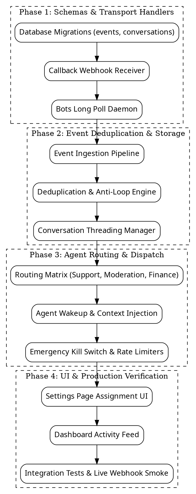

# Paperclip VK Events: Support, Payments, and Moderation Engine Specification

- **Date:** 2026-09-21
- **Target Package:** `@zaruba/paperclip-vk-community-tools`
- **Status:** Draft for Operator Review (Brainstorming Complete)
- **Target Platform:** Paperclip V1 Plugin Runtime (Node 22, TypeScript 5, React 19 peer)

---

## 1. Executive Summary & Purpose

The existing `@zaruba/paperclip-vk-community-tools` plugin provides 23 tools for outbound community management (publishing, reading messages, banning members, getting statistics) and basic UI surfaces. However, it operates purely as an on-demand toolbox without incoming awareness.

This extension introduces an **event ingestion and autonomous routing engine** supporting both **Callback API** (push via webhooks) and **Bots Long Poll API** (pull daemon without public ports). It connects real-time VK community events directly to specialized Paperclip agents:
1. **Customer Support:** Ingests `message_new`, maintains user conversation history, and dispatches responses through the assigned support agent.
2. **Payments & Subscriptions:** Detects VK Donut tier events (`donut_subscription_create`, `donut_subscription_prolonged`, `donut_subscription_cancelled`, `donut_subscription_expired`) and VK Market orders (`market_order_new`, `market_order_edit`), alerting financial and fulfillment agents.
3. **Wall & Community Moderation:** Listens to `wall_reply_new`, `wall_reply_edit`, and `market_comment_new`, allowing an assigned moderation agent to autonomously answer customer queries, delete spam, or ban abusive users.
4. **Governed Automation Gate:** **No assigned agent = no automated action.** Unassigned event streams are logged for audit and dashboard metrics only, incurring zero model costs and zero unintended side effects.

---

## 2. Event Ingestion Architecture: Callback vs. Long Poll

VK offers two official methods for community event delivery. Both use the identical JSON payload structure inside `object`, allowing a unified internal router.

```text
┌────────────────────────────────────────────────────────┐
│                   VK Community                         │
└──────────────┬──────────────────────────┬──────────────┘
               │ (Push Webhook)           │ (Pull Queue)
               ▼                          ▼
     ┌───────────────────┐      ┌────────────────────┐
     │   Callback API    │      │ Bots Long Poll API │
     │  (Endpoint Route) │      │  (Worker Poller)   │
     └─────────┬─────────┘      └─────────┬──────────┘
               │                          │
               └────────────┬─────────────┘
                            ▼
               ┌──────────────────────────┐
               │    Signature & Secret    │
               │        Validation        │
               └────────────┬─────────────┘
                            ▼
               ┌──────────────────────────┐
               │  Deduplication & Storage │
               │   (Database Namespace)   │
               └────────────┬─────────────┘
                            ▼
               ┌──────────────────────────┐
               │  Agent Routing Dispatch  │
               └────────────┬─────────────┘
             ┌──────────────┴──────────────┐
             ▼                             ▼
   [Agent Assigned: YES]         [Agent Assigned: NO]
   - Wake agent                  - Save event to audit log
   - Provide conversation context- Update dashboard stats
   - Execute approved tool action- Zero model calls
```

### 2.1 Transport Comparison & Selection

| Feature | Callback API | Bots Long Poll API |
|---|---|---|
| **Delivery Model** | Push (VK sends `POST` request) | Pull (Worker long-polls `https://{server}?act=a_check&key={key}&ts={ts}`) |
| **Public IP/Port Needed** | Yes (must be reachable via public HTTPS) | No (works behind NAT, Keenetic firewall, VPN) |
| **Handshake Requirement** | Must respond with configured `confirmation` string | Handshake via `groups.getLongPollServer` |
| **Latency** | Instantaneous (<500ms) | Low (<1500ms) |
| **Recommended Use Case** | Main production behind public domain | Reserve mode, local development, staging |

### 2.2 Inbound Webhook Endpoint for Callback API & Upstream Constraints

#### Critical Upstream Finding:
Paperclip's native plugin webhook route (`POST /api/plugins/:pluginId/webhooks/:endpointKey`, defined in `server/src/routes/plugins.ts` lines 2522-2635) has a fixed response contract:
```typescript
res.status(200).json({
  deliveryId: delivery.id,
  status: "success",
});
```
The return value of the plugin worker's `handleWebhook` RPC call is discarded by the Paperclip server host.

However, the VK Callback API specification mandates exact, unformatted string responses:
1. **Handshake (`type: "confirmation"`):** VK requires the response body to be the exact raw ASCII confirmation string (e.g. `a1b2c3d4`). A JSON wrapper causes VK to report `"Код подтверждения не совпадает"` and reject setup.
2. **Event ACK (`type: "message_new"` etc.):** VK requires the response body to be exactly `"ok"`. A JSON wrapper causes VK to treat delivery as failed and repeatedly retry with exponential backoff.

#### Dual-Strategy Architecture:
1. **Primary Autonomous Engine: Bots Long Poll API (Zero-Dependency Mode):**
   - Implemented as an autonomous background poller inside the plugin worker using `ctx.http.fetch` to `https://{server}?act=a_check&key={key}&ts={ts}`.
   - Fully independent of Paperclip server HTTP response formatting.
   - Works behind NAT, Keenetic routers, firewalls, and reverse proxies without public ports or SSL certificates.
   - Ingests the 100% identical JSON event stream (`message_new`, `donut_*`, `wall_reply_new`, `market_order_*`).
2. **Secondary Mode: Callback API via Micro-Gateway (Optional / Production-Direct):**
   - For high-volume deployments requiring sub-second push delivery, a tiny stateless edge worker (e.g. Cloudflare Worker or Nginx rewrite) can unwrap the ACK or confirm string.
   - The plugin worker exposes the identical ingestion logic in both modes.

### 2.3 Long Poll Polling Daemon
- Uses `groups.getLongPollServer` to acquire credentials (`key`, `server`, `ts`).
- Executes continuous HTTP requests with `wait=25` seconds using `ctx.http.fetch`.
- If `failed: 1` is returned, updates `ts`.
- If `failed: 2` or `failed: 3`, re-fetches long poll server parameters.
- Runs as an active background loop supervised by the plugin worker lifecycle.

---

## 3. Supported Event Types & Routing Categories

### 3.1 Category 1: Support & Direct Messages
- `message_new`: Incoming message from customer.
- `message_reply`: Outgoing message sent by human manager (updates agent context).
- `message_edit`: Message modified by sender.
- `message_allow` / `message_deny`: Customer allowed/blocked community messages.

### 3.2 Category 2: Payments & Subscriptions
- `donut_subscription_create`: Customer subscribed to community VK Donut tier.
- `donut_subscription_prolonged`: Subscription renewed successfully.
- `donut_subscription_cancelled`: Customer cancelled subscription (access remains until period ends).
- `donut_subscription_expired`: Subscription ended.
- `donut_subscription_price_changed`: Customer adjusted tier amount.
- `market_order_new`: New VK Market merchandise order placed.
- `market_order_edit`: Order status modified (paid, delivered, refunded).

### 3.3 Category 3: Wall & Content Moderation
- `wall_reply_new`: New comment on community post.
- `wall_reply_edit`: Existing comment edited.
- `wall_reply_delete`: Comment removed.
- `market_comment_new`: New comment on a VK Market item.

### 3.4 Category 4: Audit & Membership (Informational)
- `group_join`: New subscriber joined.
- `group_leave`: User unsubscribed.
- `user_block`: User banned from community.
- `user_unblock`: User unbanned.

---

## 4. Storage Architecture (Plugin Database Namespace)

Paperclip plugins declare `database.namespace.migrate` and `database.namespace.write` to maintain isolated PostgreSQL tables.

### 4.1 Schema: `vk_events`
Immutable record of every raw event delivered to the community.
```sql
CREATE TABLE vk_events (
  id UUID PRIMARY KEY DEFAULT gen_random_uuid(),
  company_id UUID NOT NULL,
  group_id BIGINT NOT NULL,
  transport VARCHAR(20) NOT NULL, -- 'callback' | 'long_poll'
  event_type VARCHAR(64) NOT NULL, -- 'message_new', 'donut_subscription_create', etc.
  event_id VARCHAR(128) NOT NULL, -- Deduplication key (e.g. 'msg_12345' or event_id from VK)
  occurred_at TIMESTAMP WITH TIME ZONE NOT NULL,
  received_at TIMESTAMP WITH TIME ZONE DEFAULT NOW(),
  peer_id BIGINT,
  user_id BIGINT,
  payload JSONB NOT NULL,
  status VARCHAR(20) NOT NULL DEFAULT 'received', -- 'received' | 'routed' | 'ignored' | 'failed'
  assigned_agent_id UUID,
  error_message TEXT,
  created_at TIMESTAMP WITH TIME ZONE DEFAULT NOW()
);

CREATE UNIQUE INDEX idx_vk_events_dedupe ON vk_events (company_id, group_id, event_type, event_id);
CREATE INDEX idx_vk_events_peer ON vk_events (company_id, peer_id, occurred_at DESC);
```

### 4.2 Schema: `vk_conversations`
Maintains customer context so agents receive full conversation history rather than isolated messages.
```sql
CREATE TABLE vk_conversations (
  id UUID PRIMARY KEY DEFAULT gen_random_uuid(),
  company_id UUID NOT NULL,
  group_id BIGINT NOT NULL,
  peer_id BIGINT NOT NULL,
  user_id BIGINT NOT NULL,
  user_name VARCHAR(255),
  status VARCHAR(32) NOT NULL DEFAULT 'open', -- 'open' | 'waiting_agent' | 'waiting_user' | 'resolved'
  last_message_text TEXT,
  last_message_at TIMESTAMP WITH TIME ZONE NOT NULL,
  assigned_agent_id UUID,
  metadata JSONB DEFAULT '{}'::jsonb,
  created_at TIMESTAMP WITH TIME ZONE DEFAULT NOW(),
  updated_at TIMESTAMP WITH TIME ZONE DEFAULT NOW()
);

CREATE UNIQUE INDEX idx_vk_conv_peer ON vk_conversations (company_id, group_id, peer_id);
```

---

## 5. Agent Assignment & Autonomous Rules

### 5.1 Assignment Configuration
Configuration is managed per-company via `companySettingsPage` and stored in plugin instance settings:

```json
{
  "eventTransport": "callback", // "callback" | "long_poll" | "disabled"
  "callbackSecret": "secret_ref_to_vault",
  "callbackConfirmationCode": "a1b2c3d4",
  
  "assignedAgents": {
    "supportAgentId": "uuid-of-support-agent", // handles message_new
    "moderationAgentId": "uuid-of-moderator-agent", // handles wall_reply_new, market_comment_new
    "financeAgentId": "uuid-of-finance-agent" // handles donut_*, market_order_*
  },

  "automationSettings": {
    "autoReplyMessages": true,
    "autoModerateSpam": true,
    "maxRepliesPerHourPerUser": 5,
    "emergencyKillSwitch": false
  }
}
```

### 5.2 The Non-Interference Invariant
- If `supportAgentId` is `null`: incoming direct messages are stored in `vk_events` and `vk_conversations`, but no agent wakeup or model call is executed.
- If `moderationAgentId` is `null`: incoming comments are logged, but no automatic deletion or banning occurs.
- If `financeAgentId` is `null`: payment events are archived for metrics and bookkeeping, without triggering autonomous agent workflows.
- If `emergencyKillSwitch` is `true`: all automated outbound actions are immediately halted at the transport layer.

### 5.3 Anti-Loop & Rate Limit Controls
To prevent bot-to-bot recursion (e.g. two bots replying to each other in an infinite loop):
1. **Per-peer rate limit:** Maximum 5 automated replies per user per hour.
2. **Echo rejection:** Events where sender is the group itself (`from_id === -groupId` or `message_reply`) are indexed into history but never trigger a new reply task.
3. **Duplicate debounce:** Identical message texts from the same user within 60 seconds are batched into a single context update.

---

## 6. UI Enhancements (Settings & Dashboard)

### 6.1 Company Settings Page (`VkCompanySettingsPage`)
1. **Transport Mode Selector:** Radio toggle between `Callback API (Webhooks)`, `Bots Long Poll (Polling Daemon)`, and `Disabled`.
2. **Callback Configuration Helper:** Displays the exact Webhook URL to paste into VK Group Settings -> Manage -> Callback API, along with the confirmation code and secret key fields.
3. **Agent Assignment Matrix:**
   - Dropdown: *Customer Support Agent* (Filtered to active company agents).
   - Dropdown: *Wall & Comment Moderator Agent*.
   - Dropdown: *Billing & Fulfillment Agent*.
4. **Emergency Kill Switch:** Prominent toggle to instantly suspend all bot responses without unbinding tokens.

### 6.2 Dashboard Widget (`VkDashboardWidget`)
Expands the existing 2x2 grid with live operational metrics:
- **Unanswered Inbox Count:** Live count of open customer conversations.
- **24h Event Velocity:** Number of incoming messages, comments, and payment events today.
- **Recent Activity Feed:** Last 5 events with colored badges (`[Support]`, `[Payment]`, `[Spam Blocked]`, `[Audit]`).

---

## 7. Phased Implementation Roadmap



---

## 8. Acceptance & Verification Criteria

1. **Test Coverage:**
   - Callback confirmation handshake responds with exact confirmation string.
   - Secret key mismatch returns HTTP 403.
   - Long poll parser correctly handles `failed: 1/2/3` error states.
   - Deduplication index blocks duplicate deliveries of identical VK event IDs.
   - Anti-loop limiter halts automated replies when rate threshold (5/hour) is exceeded.
2. **Zero-Agent Invariant:**
   - With all agent IDs set to `null`, 10 simulated events produce 10 rows in `vk_events` and zero agent wakeup calls or outbound tool calls.
3. **Clean Code & Security:**
   - 100% clean `tsc --noEmit` and `pnpm test`.
   - Zero hardcoded tokens or secrets in git history or database logs.
   - Seamless upgrade path for existing 23-tool deployment on `macbot11i7`.
